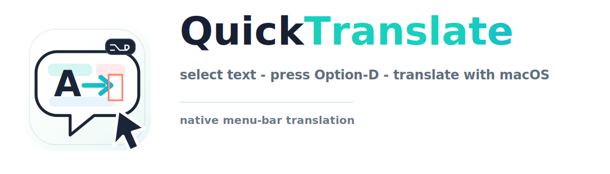
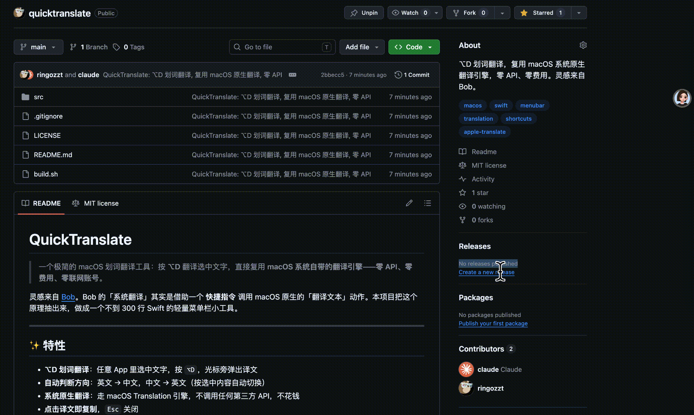

# QuickTranslate

[English](./README.en.md) · **简体中文**

<p align="center">
  
</p>

> 一个极简的 macOS 划词翻译工具：按 **⌥D** 翻译选中文字，直接复用 **macOS 系统自带的翻译引擎**——**零 API、零费用、零联网账号**。

<p align="center">
  
</p>

灵感来自 [Bob](https://bobtranslate.com/)。Bob 的「系统翻译」其实是借助一个 **快捷指令** 调用 macOS 原生的「翻译文本」动作。本项目把这个原理抽出来，做成一个不到 300 行 Swift 的轻量菜单栏小工具。

---

## ✨ 特性

- **⌥D 划词翻译**：任意 App 里选中文字，按 `⌥D`，光标旁弹出译文
- **⌥S 截图翻译 (OCR)**：按 `⌥S` 框选屏幕区域，本地 OCR 识别后自动翻译（Vision 框架，离线免费，图片/视频/PDF 里的字也能翻）
- **自动判断方向**：英文 → 中文，中文 → 英文（按内容自动切换）
- **快捷键可自定义**：菜单栏「偏好设置」里点一下录制框就能改 ⌥D/⌥S，热键冲突自行解决（无需改代码重编译）
- **系统原生翻译**：走 macOS Translation 引擎，不调用任何第三方 API，不花钱
- **点击译文即复制**，`Esc` 关闭
- **菜单栏常驻**，无 Dock 图标，几乎不占资源
- 还能「翻译剪贴板内容」

## 📦 环境要求

- macOS 12.3 或更高（依赖「快捷指令」+ 系统翻译）
- 一个用于调用系统翻译的快捷指令（见下方「准备快捷指令」）
- 首次构建需要 Xcode 命令行工具（`xcrun swiftc`）

---

## 🚀 安装

### 一键安装（推荐）

```bash
/bin/bash -c "$(curl -fsSL https://raw.githubusercontent.com/ringozzt/quicktranslate/main/install.sh)"
```

自动克隆到 `~/quicktranslate`、编译并启动。

### 手动安装

```bash
git clone https://github.com/ringozzt/quicktranslate.git
cd quicktranslate
./build.sh          # 编译并打包出 build/QuickTranslate.app
open build/QuickTranslate.app
```

启动后菜单栏会出现一个 **「译」** 字图标。

### 授予辅助功能权限（必做一次）

模拟 `⌘C` 抓取选中文字需要「辅助功能」权限：

1. 首次启动会弹权限请求，点「打开系统设置」（或点菜单栏 **译 → 辅助功能权限设置…**）
2. **系统设置 › 隐私与安全性 › 辅助功能** → 打开 **QuickTranslate** 的开关
3. 退出并**重新打开** app（权限需重启生效）

> ⌥S 截图翻译用系统 `screencapture` 框选，首次使用若提示「屏幕录制」权限，在 **隐私与安全性 › 屏幕录制** 里打开 QuickTranslate 即可。

### 用法

| 快捷键 | 功能 |
|--------|------|
| `⌥D` | 选中文字 → 翻译 |
| `⌥S` | 框选屏幕区域 → OCR 识别 → 翻译 |

> 想换快捷键？点菜单栏 **译 → 偏好设置（自定义快捷键）…**，点录制框按下新组合键即可，立即生效。和别的软件冲突时在这里改就行。

---

## 🔧 准备快捷指令

本工具通过一个快捷指令调用系统原生翻译。代码里默认调用的快捷指令名为 `Bob.Translate.v2`（如果你装过 Bob 并开启过「系统翻译」，它已经自动帮你装好了，直接能用）。

**如果你没有装 Bob**，自己建一个同名快捷指令即可（打开「快捷指令」App，新建，依次添加这些动作）：

1. **接收** `文本` 输入（来自「快捷指令输入」）
2. 从 `快捷指令输入` **获取词典**
3. 在词典中获取 `detectFrom` 的值 → 设为变量 **from**
4. 在词典中获取 `detectTo` 的值 → 设为变量 **to**
5. 在词典中获取 `text` 的值 → 设为变量 **text**
6. **翻译文本**：将 `text` 从 `from` 翻译为 `to`
7. **停止并输出** `翻译后的文本`

> 你可以给它取任意名字，然后修改 `src/main.swift` 里的 `kShortcutName` 常量。

验证快捷指令本身是否可用：

```bash
echo '{"text":"hello world","detectFrom":"","detectTo":"zh_CN"}' | shortcuts run "Bob.Translate.v2"
# 期望输出：你好，世界
```

> ⚠️ **语言标识符要用 `zh_CN` / `en_US` 这种格式**，不能用 `zh-Hans` / `en`，否则系统会报「不支持翻译」。这是踩过的坑。

---

## ⚙️ 工作原理

```
按 ⌥D（划词）
  → 模拟 ⌘C 拷贝选中文字 ─┐
                          ├→ 判断中/英方向（CJK 占比）
按 ⌥S（截图）             │   → 组装 {"text","detectFrom":"","detectTo":"zh_CN"|"en_US"}
  → screencapture -i 框选 │   → `shortcuts run` 喂给快捷指令（= 系统原生「翻译文本」动作）
  → Vision 本地 OCR ──────┘   → 光标旁弹窗显示译文
```

全局热键用 Carbon `RegisterEventHotKey`（多热键按 id 分发），OCR 用 `Vision` 框架本地识别，弹窗是无边框 `NSPanel`，整个 app 是 `LSUIElement` 菜单栏程序。

## 🛠 自定义

**快捷键**直接在 app 内「偏好设置」里改即可，无需动代码。其余可改 `src/main.swift` 顶部配置后重新 `./build.sh`：

| 常量 | 作用 | 默认 |
|------|------|------|
| `kShortcutName` | 调用的快捷指令名 | `Bob.Translate.v2` |
| `kDefaultTranslate` | 划词翻译**默认**热键 | ⌥D |
| `kDefaultOCR` | 截图翻译**默认**热键 | ⌥S |

> 用户在偏好设置里改的热键存到 `UserDefaults`，优先于以上默认值；点「恢复默认」即可还原。

目标语言判断逻辑在 `nativeTranslate()` 与 `isMostlyCJK()`，想支持更多语言可在此扩展。

## ❓ 常见问题

- **按 ⌥D 没反应 / 取不到文字**：检查「辅助功能」权限是否已打开，并重启过 app。
- **⌥S 框选后截不了图**：在「隐私与安全性 › 屏幕录制」里打开 QuickTranslate。
- **报「不支持翻译」**：语言标识符要用 `zh_CN`/`en_US`；或对应语言系统还没准备好，先用「快捷指令」App 里的「翻译文本」动作手动跑一次同语言对触发初始化。
- **⌥D / ⌥S 与其它软件冲突**：菜单栏「偏好设置」里换个组合键即可（注册失败会弹提示，换一个没被占用的）。

## 🙏 致谢

- [Bob](https://bobtranslate.com/) —— 系统翻译方案的灵感来源与快捷指令实现参考

## 📄 License

[MIT](./LICENSE)
